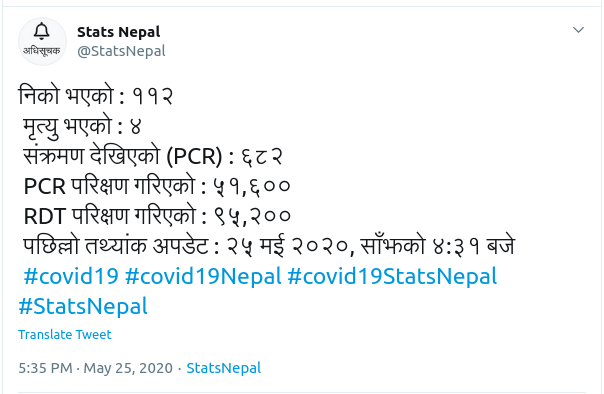
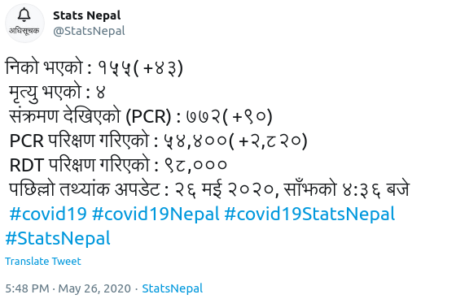

# Covid19 Stats Nepal

<div align="center">

<p><a href="https://twitter.com/StatsNepal" target="_blank" rel="noopener">Bot</a> that tweets the Covid19 Stats Of Nepal.
</div>

[](https://standardjs.com)

## Tweet




## Prerequisites

- [Node.js](https://yarnpkg.com/en/docs/install)
- [Yarn](https://yarnpkg.com/en/docs/install)
- [NPM](https://docs.npmjs.com/getting-started/installing-node)
- [PostgreSQL](https://www.postgresql.org/download/) / [MySQL](https://www.mysql.com/downloads/) / [SQLite](https://www.sqlite.org/download.html)

## Installation

1. create `env`

   ```bash
   cp .env.example .env
   ```

   update the application and database credentials.

   `.env` for simple sqlite database setup

   ```
   DB_CLIENT=sqlite
   DB_DATABASE=./storage/covid19-stats-nepal.sqlite
   ```

   - If you wish to cron to run **every minute inorder** to fetch the data and the listed attributes (`recovered`, `pcr_positive`, `pcr_sample_tested`) to be observed for change. add these below env variables to `.env`

   ```
   STAT_CRON_EXPRESSION=* * * * *
   DATA_TO_BE_OBSERVED=recovered,pcr_positive,pcr_sample_tested
   ```

2. Run migration

   ```bash
    yarn run knex migrate:latest
   ```

   if you wish to seed

   ```bash
    yarn run knex seed:run
   ```

3. Add [Twitter Secrets]('https://developer.twitter.com/') to `.env`
   ```
   TWITTER_CONSUMER_KEY=
   TWITTER_CONSUMER_SECRET=
   TWITTER_ACCESS_TOKEN=
   TWITTER_ACCESS_TOKEN_SECRET=
   ```
4. Start the application

   ```bash
   yarn dev (for development)
   NODE_ENV=production yarn start (for production)
   ```

### To run the worker manually

```bash
yarn worker
```

### for `knex` commands

```bash
yarn knex --help
```

## Uses:

- ES7 [async](https://developer.mozilla.org/en-US/docs/Web/JavaScript/Reference/Statements/async_function)/[await](https://developer.mozilla.org/en-US/docs/Web/JavaScript/Reference/Operators/await)
- [Bookshelf](http://bookshelfjs.org/) ORM and [Knex](http://knexjs.org/) migrations
- SQLite (default) with support for MySQL and PostgreSQL
- [dotenv](https://www.npmjs.com/package/dotenv) for configuration management
- [winston](https://www.npmjs.com/package/winston) for logging
- [jest](https://www.npmjs.com/package/jest), [supertest](https://www.npmjs.com/package/supertest) for testing

## Credits

Template : [Bootstrap Pricing](https://getbootstrap.com/docs/4.5/examples/pricing), Timeline: [Brady Wright](https://codepen.io/brady_wright/pen/NNOvrW)

## License

[GNU General Public License v3.0](LICENSE)
